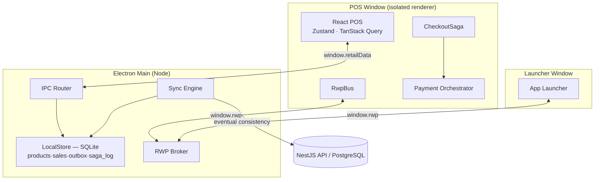

# Retail OS — Architecture

> Master architecture document. Companion files: [ADRs](adr), [Domain Model](domain-model.md),
> [Event Catalog](event-catalog.md), [Database Model](database-model.md), [API Spec](api-spec.md),
> [Security](security-model.md), [Sync Engine](sync-engine.md), [Payments](payments.md),
> [Diagrams](diagrams/diagrams.md), [Roadmap](roadmap.md).

## 1. Vision

Retail OS is a modular **Retail Operating System** — a Point of Sale first, ERP-ready
platform engineered to scale from a single store to a multi-tenant SaaS processing
millions of transactions. The POS is the first production-ready module; every future
module (inventory, CRM, reporting, accounting, ecommerce, loyalty) plugs into the same
platform with **no architectural change**.

## 2. Architectural principles

| Principle | How Retail OS realizes it |
|-----------|---------------------------|
| Domain-Driven Design | Bounded contexts as isolated libraries under `libs/domain/*`, each with its own ubiquitous language; a `shared-kernel` for `Money`, ids, `Result`, domain events. |
| Clean / Hexagonal | Domain depends on nothing but the kernel. Infrastructure (DB, payment providers, transport) sits behind **ports** (`IPaymentProvider`, `RwpTransport`, `SyncTarget`, `SagaStore`). |
| Event-Driven | Aggregates record domain events; the transactional outbox ships them; the RWP bus publishes UI-facing events. |
| Offline-First | The POS owns a durable SQLite store. No sale is ever lost without a network. |
| API-First | The sync ingestion contract and REST surface are specified independently of implementation. |
| Modular Monolith → Microservice-ready | One deployable backend (NestJS) with hard module boundaries; contexts can later be extracted behind the same contracts. |
| Multi-Tenant ready | Every record is tenant + store scoped; RBAC principals are tenant-scoped. |
| Saga-oriented | Checkout/payment is a **distributed transaction modeled as a Saga** with compensations — no 2PC. |

## 3. Monorepo topology (Nx + pnpm)

```
apps/        desktop-shell (Electron) · pos (React) · backoffice (Angular) · api (NestJS)
libs/rwp/    rwp-core · rwp-bus · rwp-electron-adapter
libs/domain/ shared-kernel · catalog · inventory · sales · customers · promotions · payments
libs/platform/ saga · app-registry · workspace-engine · security
libs/payments/ payment-orchestrator · provider-mercadopago · provider-codi
libs/sync/   sync-engine        libs/data/ local-db · db-postgres
libs/shared/ shared-types · observability · ui-react
```

**Dependency rule** (enforced by Nx tags + review):

```
apps  →  payments | sync | data | platform  →  domain  →  shared-kernel
```

A domain library imports **only** `shared-kernel`. No business logic is shared across
bounded contexts; contexts integrate through events and the RWP bus, never by reaching
into each other's models.

## 4. Process & runtime architecture

Retail OS runs as an Electron desktop application with a strict two-process split:

- **Main process** (Node) — owns the SQLite database, the RWP **broker**, the sync
  engine, window management, and the secure IPC surface. The only place Node and native
  modules (`better-sqlite3`) execute.
- **Renderer processes** (context-isolated, no Node) — the launcher and each hosted app
  (the React POS). They reach the main process only through the audited preload bridge
  (`window.rwp`, `window.retailData`).



## 5. Retail Workspace Protocol (RWP)

RWP is our deliberate replacement for FDC3 (see [ADR-0002](adr/0002-rwp-over-fdc3.md)).
Every message is a typed envelope (`eventId, correlationId, timestamp, source, target,
version, kind, type, payload`). The `RwpBus` (RxJS) offers `publish` / `subscribe` /
`request` / `respond` / `setContext` / `getContext`, plus typed intents and commands.
A pluggable `RwpTransport` makes the same API work in-process or across Electron windows
via the main-process broker. See the [Event Catalog](event-catalog.md).

## 6. The checkout Saga

Checkout spans the sales, payments, inventory and sync contexts — a textbook distributed
transaction. Retail OS models it with the **Saga pattern** (orchestration-based):

```
begin-tender → reserve-stock → collect-payment → finalize(commit + persist)
   compensations (reverse):  void/reopen ← release ← refund
```

The POS never calls a payment provider; `collect-payment` asks the **Payment Orchestrator**
to start the payment and awaits the unified `rwp.payment.completed` event. A declined or
timed-out payment throws, the orchestrator compensates, and the cart is preserved. Saga
progress is checkpointed to the `saga_log` table, so a terminal that crashes mid-payment
recovers on boot. Details in [ADR-0004](adr/0004-saga-checkout.md) and [payments.md](payments.md).

## 7. Data & synchronization

- **Local (edge): SQLite** — `products` cache, committed `sales`, a transactional
  `outbox`, and the `saga_log`. Synchronous, sub-millisecond, durable.
- **Central: PostgreSQL (Prisma)** — multi-tenant master data, the sync sink, reporting.
- **Sync engine** — drains the outbox to the API with exponential backoff and
  at-least-once delivery; server-side idempotency keys give exactly-once *effect*. No
  distributed transactions, no two-phase commit — pure **eventual consistency**.

See [sync-engine.md](sync-engine.md) and [database-model.md](database-model.md).

## 8. Frontend strategy

- **React POS** (`apps/pos`) — Vite + Zustand + TanStack Query. Chosen for raw runtime
  performance: product search < 50ms (in-memory index), cart update < 16ms (totals on a
  mutable aggregate), payment UI < 100ms, startup < 2s.
- **Angular backoffice** (`apps/backoffice`) — standalone components, Signals, NgRx
  Signal Store, AG Grid. For ERP/reporting/admin maintainability. (Scaffold this pass.)

See [ADR-0006](adr/0006-react-pos-angular-backoffice.md).

## 9. Security

JWT auth, role-based access control, append-only audit log, device registration,
hardened Electron (contextIsolation, CSP, no nodeIntegration), and a multi-tenant data
model. See [security-model.md](security-model.md).

## 10. Observability

Structured JSON logging with **correlation IDs** threaded from the POS through the saga,
the payment orchestrator and the sync engine; OpenTelemetry-ready sinks; health checks on
the API. See `libs/shared/observability`.

## 11. What runs today vs. the roadmap

**Runnable now:** offline POS (search → cart → discounts/IVA → charge → simulated MP Point
/ CoDi payment → saga commit → SQLite + outbox + sync), inside the hardened Electron shell,
with 24 unit tests covering Money, the Sale aggregate, the saga (incl. compensation), the
RWP bus, the payment orchestrator's unified events, and the offline outbox drain/retry.

**Documented & scaffolded:** NestJS API + sync ingestion contract, Postgres/Prisma schema.

**Roadmap:** live provider APIs + webhooks, cloud bi-directional sync at scale, Angular
backoffice modules, auto-update, runtime multi-tenant isolation, Phase 2/3 providers.
Full plan in [roadmap.md](roadmap.md).
