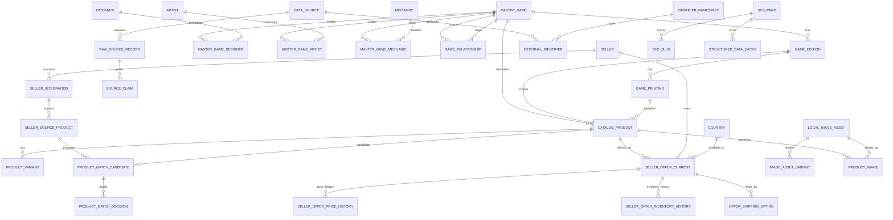

# Juegospedia next-generation platform

Status: implemented foundation, additive migration pending production rollout  
Owners: Product, Architecture, Catalog, Commerce, Search, SEO, Data  
Source of truth: PostgreSQL + Prisma schema in `libs/data/db-postgres/prisma/schema.prisma`

## 1. Product thesis and non-negotiable invariants

Juegospedia is the identity, knowledge, discovery, and comparison layer for board games. It is not a retailer-owned product database.

The permanent identity chain is:

```text
MasterGame -> GameEdition -> GamePrinting -> CatalogProduct -> ProductVariant
                                                        |
                                                        +-> SellerOfferCurrent
                                                               |
                                                               +-> price/inventory history
```

The following invariants are enforced by the model and rollout policy:

1. Juegospedia owns every canonical ID. Marketplace IDs are external identifiers only.
2. `MasterGame`, `GameEdition`, `GamePrinting`, and `CatalogProduct` can exist with no seller.
3. `SellerOfferCurrent` can change continuously without mutating canonical knowledge.
4. Raw imports create immutable observations and field-level claims; they never write canonical facts directly.
5. Canonical changes are attributable, auditable, mergeable, reversible, and moderated.
6. Global knowledge is not tenant-scoped. Tenant and seller boundaries begin at integrations, offers, policies, campaigns, and private user data.
7. PostgreSQL is authoritative. Search engines, caches, structured-data payloads, materialized views, and graph exports are projections that can be rebuilt.
8. A public offer cannot go live until its source product is confirmed against a canonical catalog product.
9. Images are published from Juegospedia-controlled storage only when source authorization allows ingestion.
10. Sponsored placement changes ranking only within disclosed commercial slots. It never changes canonical relevance or factual catalog data.

## 2. Repository reality and target runtime

The supplied context says Angular, but this repository currently uses:

- Next.js SSR for the apex knowledge/SEO site (`apps/web`);
- React/Vite for the transactional marketplace and portals;
- NestJS for APIs;
- Prisma/PostgreSQL for authoritative data;
- BullMQ/Redis for background jobs;
- Typesense for the current search projection.

The architecture is frontend-independent. New SEO routes belong in the Next.js apex app until an explicit frontend migration is approved. Replacing a functioning SSR surface with Angular is not a prerequisite for the catalog.

## 3. Bounded contexts

| Context | Owns | Does not own |
|---|---|---|
| Canonical catalog | works, editions, printings, sellable products, variants, contributors, taxonomy | seller price, stock, fulfillment |
| Provenance | sources, raw records, claims, attributions, external identifiers | canonical truth decisions |
| Moderation | review queues, decisions, merges/splits, audit history | ingestion transport |
| Media | authorized acquisition, hashes, variants, local/CDN assets, licenses | remote source availability |
| Matching | source products, candidates, scores, decisions | canonical field mutation |
| Commerce | current offers, shipping, tax, return policy, coupon, cashback | permanent game identity |
| Affiliate | accounts, outbound clicks, conversions, commission state | seller order fulfillment |
| SEO | localized pages, slugs, redirects, structured-data cache, sitemap eligibility | canonical facts |
| Search | rebuildable denormalized documents and engine adapters | source of truth |
| Knowledge graph | typed graph edges and graph export | primary fact storage |
| User library | collections, wishlists, alerts, recommendation profiles | public canonical data |
| Analytics | append-only behavioral events and aggregate metrics | transactional offer state |

## 4. Domain model

### 4.1 Canonical knowledge

`MasterGame` is the intellectual work. It owns stable gameplay facts and links to designers, artists, original publishers, studios, mechanics, categories, themes, families, series, franchises, universes, awards, age ratings, language dependency, rulebooks, related games, and digital implementations.

`GameEdition` is a materially distinct edition/localization/region release. A simple reprint is not an edition. A changed language, publisher localization, ruleset, component set, or edition identity may be.

`GamePrinting` is a production run. It stores print number/year, manufacturing country, corrections, errata, measurements, weight, and printing identifiers.

`CatalogProduct` is a seller-independent sellable identity. It covers games, expansions, promos, accessories, RPG books, sleeves, organizers, miniatures, playmats, rulebooks, magazines, replacements, bundles, digital items, and future product types. It may point to a game, edition, and printing, but accessories can exist independently and connect through `AccessoryCompatibility`.

`ProductVariant` represents a canonical purchasable variation beneath a catalog product, such as language/region, color, pack size, or format. Seller-specific variation IDs remain external identifiers.

### 4.2 Contributors and controlled vocabularies

Designers and artists are people. Publishers and studios are organizations. Join records have their own IDs, ordering, role, and timestamps so contribution history can be attributed and extended.

Mechanic, category, theme, family, series, franchise, and universe are separate canonical entity types. `EntityLocalization` supplies translated names and descriptions without duplicating the canonical node. `SeoPage` owns page copy, not the taxonomy entity.

Player count, age, play time, complexity, and language dependency are first-class filterable fields on `MasterGame`; jurisdiction-specific ratings use `AgeRating`.

### 4.3 Provenance and identifiers

The ingestion chain is:

```text
ImportJob
  -> RawSourceRecord (immutable payload observation)
  -> SourceClaim (one field/value assertion)
  -> moderation/confidence policy
  -> canonical transaction
  -> CanonicalAuditLog
  -> reindex + SEO/JSON-LD invalidation
```

`ExternalIdentifier` is polymorphic by `entityType/entityId`, source-attributed, confidence-scored, country-aware, and unlimited. `IdentifierNamespace` is a reference table rather than an enum so new ecosystems do not require a database type migration.

Verified identifier values are globally unique within namespace and marketplace country. Unverified observations may conflict until moderation resolves them.

Source priority is:

1. verified human override;
2. official publisher/manufacturer;
3. verified identifier registry;
4. trusted catalog/knowledge source;
5. seller feed;
6. marketplace listing;
7. AI inference.

Priority is not automatic truth. Freshness, field scope, agreement, and explicit conflicts are also evaluated.

### 4.4 Commerce

`SellerSourceProduct` is the imported seller/marketplace record. It is not a catalog product. A confirmed match may point it to one `CatalogProduct`.

`SellerOfferCurrent` is the hot current-state table. It stores one seller offer's current price, availability, URLs, condition, fulfillment, delivery, tax profile, return policy, market, and ranking inputs.

`SellerOfferPriceHistory` and `SellerOfferInventoryHistory` are append-only monthly partitions. They never participate in ordinary product-page reads. `catalog_product_offer_summary` is the rebuildable country/currency aggregate used by product pages and indexing.

Amounts are integer minor units in `BIGINT`. Currency is explicit on every monetary record. Exchange conversion is a display/analysis concern and never overwrites the source amount.

### 4.5 Multi-tenancy

Canonical public knowledge is global. A tenant cannot fork the identity of Catan. Tenant isolation applies to:

- credentials and integrations;
- affiliate accounts;
- private configuration;
- seller operations;
- campaigns and reports;
- private user/merchant data.

`TenantMarket` and `SellerMarket` define enabled country/currency/language combinations. Database row-level security is a production hardening phase for tenant-private tables; API authorization remains mandatory even with RLS.

## 5. Core ER diagram



The full Prisma model is authoritative; this diagram intentionally shows the identity and commerce spine rather than every supporting table.

## 6. Migration and cutover plan

The checked-in database change is additive and has been executed successfully from an empty PostgreSQL 16 database. Legacy `MktProduct`, `Listing`, and `SellerProductMapping` remain operational until cutover.

### Phase 1 — core catalog

- Create master games, editions, printings, products, variants, contributors, taxonomy, relationships, and localizations.
- Backfill one `MasterGame`, default `GameEdition`, inferred `GamePrinting` when evidence exists, and `CatalogProduct` for every verified `MktProduct`.
- Persist `legacy_mkt_product_id` as an external identifier/custom source ID; never use it as the new primary key.

### Phase 2 — provenance and external IDs

- Register sources and identifier namespaces.
- Convert BGG IDs and marketplace IDs into `ExternalIdentifier` rows.
- Store future imports as raw records and claims before canonical writes.
- Block duplicate verified GTIN/ISBN/UPC/EAN assignment.

### Phase 3 — commerce

- Create seller integrations, markets, current offers, histories, shipping, taxes, return policies, coupons, cashback, and affiliate accounts.
- Backfill `Listing` into `SellerOfferCurrent`; retain legacy IDs in source metadata.
- Begin dual-write current offer + append-only histories.

### Phase 4 — matching

- Import seller records into `SellerSourceProduct`.
- Run exact identifier matching before fuzzy/semantic matching.
- Require `ProductMatchDecision` for all automatic and human resolutions.
- Stop new writes to `SellerProductMapping` after all consumers use v2.

### Phase 5 — SEO

- Create `SeoPage`, localized slugs, slug history, 301 redirects, and structured-data caches.
- Launch entity routes in batches only after quality thresholds and redirect validation.
- Keep legacy routes as permanent redirects, never parallel indexable duplicates.

### Phase 6 — search

- Build all typed `SearchDocument` projections from PostgreSQL.
- Create new search collections/aliases, backfill, compare result quality, then atomically switch aliases.
- Keep the old Typesense collection available for rollback.

### Phase 7 — users

- Enable collections, wishlists, and alerts after product identity stabilizes.
- Map old user references through catalog-product backfill tables.

### Phase 8 — analytics and affiliate

- Start first-party click IDs before outbound redirects.
- Reconcile callback conversions idempotently.
- Separate estimated from confirmed commission and payout state.

### Phase 9 — graph and AI enrichment

- Emit moderated graph edges from canonical relationships and joins.
- Store AI proposals separately; require cited source claims for factual publication.
- Enable optional pgvector columns only where the server package is installed.

### Phase 10 — scale and archival

- Precreate monthly partitions and monitor the default partition.
- Retain 12–18 months hot in PostgreSQL, older partitions warm on cheaper PostgreSQL/object storage, and analytical copies in columnar storage.
- At sustained multi-billion history scale, shard by region/seller hash or adopt Citus-compatible distribution. A single unsharded PostgreSQL heap is not a credible 10-billion-row operating target.
- Archive immutable events as Parquet with manifests/checksums while PostgreSQL retains the catalog and current-offer truth.

### Cutover controls

Each phase uses: schema deploy -> backfill -> shadow read comparison -> dual write -> consumer switch -> observation window -> legacy write freeze. Destructive cleanup is a separate release after backups and rollback windows expire.

## 7. Product matching engine

### Candidate generation order

1. Exact verified GTIN/EAN/UPC/ISBN.
2. Exact trusted marketplace/source ID mapping.
3. Publisher/manufacturer SKU scoped to publisher/market.
4. ASIN-to-GTIN mapping.
5. Normalized title + language + publisher + edition + year.
6. Perceptual image similarity.
7. Dimension and weight similarity.
8. Semantic embedding similarity.
9. Manual review/search.

### Scoring

The engine records every signal and conflict. An example calibrated score is:

```text
trusted exact GTIN                    1.00
trusted exact external ID             0.98
publisher SKU + publisher             0.95
title                                 up to 0.35
language/region                       up to 0.15
publisher                             up to 0.15
edition/year                          up to 0.10
image                                 up to 0.15
dimensions/weight                     up to 0.05
semantic similarity                   up to 0.05
conflicting verified identifier       hard stop
base-game vs expansion disagreement   hard stop
language or edition disagreement      -0.15 to hard stop
```

Policy:

- `>= 0.95`: auto-approve trusted exact identity;
- `0.85–0.94999`: auto-approve only with no conflicts and sufficient lead over candidate two;
- `0.65–0.84999`: manual review;
- `< 0.65`: do not suggest as a match.

An approved match links the source product to a canonical product. It does not copy seller descriptions/images/titles into canonical fields. Those remain claims.

## 8. Image acquisition and local storage

The media worker is provider-agnostic through storage and processing ports.

1. Confirm source authorization/terms and source-level image permission.
2. Enforce HTTPS, DNS/IP allow/deny rules, redirect limits, timeout, and maximum bytes to prevent SSRF/bombs.
3. Stream into a quarantined temporary file; validate magic bytes rather than trusting headers.
4. Malware scan where available.
5. Compute SHA-256 and perceptual hash.
6. Reuse an existing asset on exact hash; flag near-duplicates for moderation.
7. Strip unsafe metadata and normalize color profile/orientation.
8. Generate original, 1600, 1200, 800, 400, thumbnail, and OG variants in AVIF/WebP plus JPEG/PNG fallback.
9. Write to local filesystem atomically first; production adapters support S3, R2, GCS, and Azure Blob.
10. Persist `LocalImageAsset`, variants, license, source URL, attribution, dimensions, colors, and moderation state.
11. Attach by entity and role; publish only the local/CDN URL.
12. Treat failure as non-fatal and retry with bounded exponential backoff + dead-letter queue.

Storage keys are content-addressed (`sha256/ab/cd/<hash>/<variant>.<ext>`). This makes retries idempotent and CDN invalidation rare.

## 9. Search architecture

`SearchDocument` is a PostgreSQL rebuild checkpoint, not the online index itself. `documentType` creates these projections:

1. game;
2. product;
3. offer;
4. designer;
5. publisher;
6. mechanic;
7. category;
8. collection;
9. SEO landing page.

Every projection includes canonical ID, type, title/alternates, normalized title, locale and localized slugs, summary, image, ranking scores, price range, country/currency availability, structured facets, searchable text, embedding fallback, and indexing timestamp.

Recommended engine path:

- Typesense remains suitable for MVP instant search/facets.
- OpenSearch becomes preferable when multilingual analyzers, advanced synonyms, hybrid lexical/vector ranking, and very large offer indexes become dominant.
- Engine collection names are versioned. A stable alias switches atomically after a full rebuild and validation.

Ranking separates organic relevance from commercial value:

```text
organic_score = lexical + semantic + entity_quality + popularity + availability
commercial_score = conversion + affiliate_value + seller_quality
```

Commercial score may break ties or fill disclosed sponsored slots; it must not make an irrelevant item appear relevant.

## 10. Knowledge graph

Normalized joins remain the strongest truth for known relation types. `KnowledgeGraphEdge` is the generic export/extension layer for cross-domain edges.

Graph jobs emit nodes and edges to JSON-LD, RDF-like exports, or a graph database without making a graph database authoritative. Edge moderation and provenance are mandatory. Bidirectional relationships are normalized consistently to prevent duplicate reverse edges.

Uses include internal links, compatible accessories, expansions, same designer/mechanic/universe, recommendations, comparison candidates, related entities, and LLM entity APIs.

## 11. SEO and URL architecture

### Canonical routing rule

Knowledge pages are language-localized; commerce aggregations may additionally be country-specific. Do not create both `/mx/...` and `/es/...` versions of the same knowledge page as indexable duplicates.

Recommended canonical families:

```text
/{locale}/juegos/{game-slug}
/{locale}/juegos/{game-slug}/ediciones/{edition-slug}
/{locale}/juegos/{game-slug}/impresiones/{printing-slug}
/{locale}/productos/{product-slug}
/{locale}/productos/{product-slug}/precios
/{locale}/productos/{product-slug}/ofertas
/{locale}/disenadores/{designer-slug}
/{locale}/artistas/{artist-slug}
/{locale}/editoriales/{publisher-slug}
/{locale}/mecanicas/{mechanic-slug}
/{locale}/categorias/{category-slug}
/{locale}/temas/{theme-slug}
/{locale}/familias/{family-slug}
/{locale}/series/{series-slug}
/{locale}/franquicias/{franchise-slug}
/{locale}/premios/{award-slug}
/{locale}/colecciones/{collection-slug}
/{locale}/comparar/{game-a}-vs-{game-b}
/{locale}/mejores/{collection-slug}
/{locale}/{country-code}/ofertas/juegos-de-mesa
/{locale}/tiendas/{seller-slug}
```

Unlocalized `/games/...` routes redirect to the negotiated/default locale. Historical slugs resolve through `SeoSlug`/`SeoRedirect` with one hop to the current canonical URL.

### Indexability gates

A generated page is indexable only when:

- the entity is published and moderated;
- localized title/description are complete;
- item count and data diversity exceed page-type thresholds;
- content is not materially duplicated by another canonical page;
- offers are not required for the page's informational value;
- structured data validates;
- the page returns 200 with crawlable SSR HTML.

Low-value filters, empty combinations, internal search, and pagination variants are `noindex,follow` with canonical rules appropriate to their content.

### Sitemap strategy

Use a sitemap index partitioned by locale, entity type, and shard, maximum 50,000 URLs/file with conservative byte limits. Publish image sitemaps only for authorized local assets. `lastmod` changes on meaningful content/offer-summary changes, not every request.

### AI discoverability

AI visibility comes from accessible crawlable pages, stable entity IDs/URLs, clear provenance, sameAs identifiers, structured relationships, useful text, and optional public entity feeds/APIs. No architecture can guarantee inclusion in ChatGPT, Gemini, Claude, Perplexity, Copilot, or Google AI Overviews. `llms.txt` may be offered as a convenience, not treated as a ranking standard.

## 12. Structured data

Page emitters use one coherent `@graph` with stable `@id` URLs:

- site: `WebSite`, `Organization`, `SearchAction`;
- game: `WebPage` + `CreativeWork` and, when a purchasable product is represented, linked `Product`;
- product: `Product` + `AggregateOffer`; individual `Offer` nodes are included only when accurate and policy-compliant;
- seller: `Organization`/`Store`, return policy, shipping details;
- contributor: `Person` or `Organization`;
- mechanic/category/theme: `DefinedTerm`;
- lists: `CollectionPage` + `ItemList`;
- editorial: `Article`/`NewsArticle`, FAQ only for visible genuine FAQs;
- navigation: `BreadcrumbList` on every entity/list page.

GTIN/ISBN/UPC properties are emitted only from verified identifiers. Prices use one currency per `AggregateOffer`; mixed currencies produce separate country/currency offer groups. Cache invalidation keys include canonical entity version, offer-summary version, locale, and country.

## 13. Internal linking

Links are derived from canonical joins and moderated graph edges, never generated randomly.

- Games link to editions, printings, products, expansions, accessories, contributors, taxonomy, awards, comparisons, guides, price pages, and related games.
- Products link upward to game/edition/printing and sideways to offers, price history, compatible products, alternatives, and seller pages.
- Contributor/taxonomy/publisher pages link to substantial game lists and adjacent entities.
- Seller pages link to active offers, categories carried, delivery markets, and disclosed deal pages.

Each template has a link budget and relevance threshold. Paginated or faceted collections expose crawlable stable links without generating infinite combinations.

## 14. API architecture

REST is the default public/cacheable interface:

```text
GET /api/v2/games/:id-or-slug
GET /api/v2/games/:id/editions
GET /api/v2/products/:id-or-slug
GET /api/v2/products/:id/offers?country=MX&currency=MXN
GET /api/v2/products/:id/price-history
GET /api/v2/search
GET /api/v2/sellers/:slug
POST /api/v2/affiliate/outbound
GET /api/v2/seo/resolve?path=...
GET /api/v2/structured-data/:seoPageId
```

Admin surfaces cover claims, moderation, merges/splits, matching, imports, media, and SEO generation. Seller APIs cover signed webhooks, imports, offer/inventory/price updates, match review, and dashboard aggregates.

GraphQL is optional for authenticated editorial/admin exploration of deeply nested knowledge. It is not the public SEO delivery mechanism.

All writes use idempotency keys, optimistic entity versions where needed, audit correlation IDs, and an outbox event in the same transaction. Webhooks are signature-verified and replay-safe.

## 15. Seller onboarding

1. Create/authenticate seller and tenant connection.
2. Configure seller markets, settlement currency, tax, shipping destinations, return policy, and pickup.
3. Select integration provider.
4. Complete OAuth/API credentials; encrypt tokens and store minimum scopes.
5. Start resumable import job and persist raw records.
6. Normalize source records and external IDs.
7. Generate product match candidates.
8. Auto-approve only policy-safe matches.
9. Present medium-confidence candidates and conflicts for review.
10. Allow seller to confirm, reject, or request a new canonical record.
11. Route new-record requests to catalog moderation; seller cannot publish canonical facts directly.
12. Activate offers only after match confirmation and policy validation.
13. Show active offers, unmatched products, competitiveness, inventory health, clicks, conversions, estimated/confirmed revenue, SEO exposure, and sponsorship controls.

## 16. Ingestion and background jobs

Queues are separated by workload and rate limit:

- `catalog.raw.fetch`;
- `catalog.claim.normalize`;
- `catalog.match`;
- `catalog.moderate`;
- `media.acquire`;
- `offer.current.sync`;
- `offer.history.append`;
- `affiliate.performance.sync`;
- `search.project` / `search.publish`;
- `seo.generate` / `seo.invalidate`;
- `graph.project`;
- `alerts.evaluate`.

Jobs use deterministic IDs, bounded exponential retry with jitter, provider-specific concurrency, a dead-letter queue, correlation IDs, and checkpoint cursors. A failed image or enrichment task does not roll back a successful source-product/offer sync.

Provider adapters cover BGG, Wikidata, official publisher feeds, Amazon PA API, Mercado Libre, Shopify, Tiendanube, WooCommerce, CSV, manual admin, and AI proposals. Terms, authorization, quotas, and attribution differ by provider and are configuration, not assumptions in generic workers.

## 17. Affiliate architecture

Affiliate configuration is scoped by marketplace, country, currency, language, tenant/seller, campaign, and channel. Outbound redirects create a first-party event ID before redirecting to a generated/deep link.

Amazon accounts support marketplace country, affiliate tag/tracking ID, ASIN/parent ASIN, PA API credentials, and manual fallback URLs. Mercado Libre stores item/catalog IDs, permalink, official-store/shipping metadata, and future referral IDs. Shopify/Tiendanube/WooCommerce retain shop/product/variant IDs and UTM attribution.

Conversions reconcile asynchronously against click IDs and provider callbacks. Estimated and confirmed commissions are separate amounts; reversals are retained, not deleted.

## 18. Data quality, merge, and split

Canonical merge is transactional:

1. lock source and destination entities;
2. record before state;
3. move/reconcile joins, identifiers, products, SEO pages, and graph edges;
4. mark source `MERGED` with `mergedIntoId`;
5. create redirects;
6. write audit/outbox events;
7. rebuild projections.

Split creates new canonical IDs and requires human allocation of claims/identifiers/children. It never rewrites historical audit or source records.

Staleness is field/source-specific. Offer TTL may be minutes; a designer credit may remain valid indefinitely. Manual overrides are protected from lower-priority imports unless explicitly released.

## 19. Scalability and SLOs

### Storage

- Canonical entities: normalized PostgreSQL, read replicas, aggressive index discipline.
- Current offers: indexed hot table, country/product/seller access paths, short cache TTL.
- Histories/clicks/analytics: append-only monthly partitions, compression/archive pipeline, no OLTP joins on page requests.
- Images: object storage + CDN; local filesystem adapter for initial development only.
- Search: replicated dedicated engine rebuilt from PostgreSQL projections.
- Cache: Redis for hot entity/offer summaries, rate limits, idempotency, and job coordination.

### Scale thresholds

- At 100 million products, partition large auxiliary tables, use read replicas, and consider catalog hash sharding while preserving globally unique Juegospedia IDs.
- At 10 billion snapshots, keep a bounded hot retention window in PostgreSQL and archive immutable partitions. Use distributed PostgreSQL or regional clusters for sustained write scale.
- Affiliate/analytics events may stream to Kafka/Redpanda and columnar analytics, while the authoritative attribution ledger remains in PostgreSQL.

### Initial SLOs

- cached game/product page API p95 < 150 ms;
- offer comparison API p95 < 250 ms;
- search p95 < 150 ms;
- seller webhook acknowledgement < 2 s;
- current price/inventory freshness: provider SLA + 5 minutes;
- canonical update to search/SEO invalidation p95 < 5 minutes;
- no lost acknowledged import jobs; at-least-once delivery with idempotent consumers.

## 20. MVP and 12-month roadmap

### MVP (months 0–3)

- Deploy additive schema and source reference data.
- Backfill master games, editions, products, external IDs, sellers, and offers.
- Implement claims, matching rules, admin queue, local image storage, and Typesense v2 projections.
- First-class Amazon affiliate, Mercado Libre, Shopify, and Tiendanube adapters.
- SSR game/product/price pages, `Product + AggregateOffer`, breadcrumbs, canonical/hreflang, sitemap shards.
- Affiliate redirect/click ledger and price comparison.

### Phase 2 (months 4–6)

- Wishlists, collections, price/availability/restock alerts.
- Seller dashboard, richer recommendations, WooCommerce/CSV/custom API.
- Media CDN migration and AI proposal moderation.
- High-quality mechanic/player-count/category/designer/publisher landing pages.

### Phase 3 (months 7–9)

- Direct checkout pilot, payments, cashback, sponsored placements with disclosure.
- Advanced seller analytics and bulk/public/affiliate APIs.
- More shipping/tax/return-policy structured data.

### Phase 4 (months 10–12)

- Additional countries/languages and regional search/offer infrastructure.
- Graph/entity API, larger publisher feeds, price intelligence, demand models.
- Collection valuation foundation and trade-marketplace discovery (separate transaction domain).

## 21. Testing strategy

1. Prisma validation and migration-from-empty on PostgreSQL 16.
2. Migration test from a production-like anonymized snapshot, including rollback rehearsal.
3. Property tests for money, identifier normalization, matching thresholds, and graph direction.
4. Contract tests for every provider adapter with recorded fixtures and webhook signature/replay cases.
5. Database integration tests for unique verified identifiers, compatibility target checks, current offer upsert + history append, merge redirects, and tenant authorization.
6. Search golden-query tests, facet parity, typo/synonym tests, multilingual analyzers, and rebuild determinism.
7. JSON-LD snapshot + Schema.org/Google validation tests by page type.
8. SSR crawl tests with JavaScript disabled, canonical/hreflang/robots/sitemap checks, and broken internal-link scans.
9. Media security tests for SSRF, redirect loops, decompression bombs, MIME spoofing, duplicate hashes, and license states.
10. Load tests for offer writes, product reads, partition rollover, affiliate clicks, and queue backlog recovery.
11. Disaster-recovery restore, search rebuild, materialized-view rebuild, and object-storage integrity drills.

## 22. Deployment strategy

1. Provision extension packages and verify backups, replication lag, disk headroom, and lock timeouts.
2. Run additive migrations before application code; migrations never rename/drop legacy tables.
3. Deploy dormant v2 code paths behind per-context feature flags.
4. Backfill in small resumable primary-key ranges with rate limits and checkpoints.
5. Run shadow reads comparing legacy/v2 identities, offers, prices, and URLs.
6. Enable dual write; alert on divergence.
7. Switch internal APIs, search alias, then public routes independently.
8. Observe at least one full seller sync/offer TTL and SEO crawl cycle.
9. Freeze legacy writes, retain rollback adapters, and remove legacy tables only in a later audited release.

The optional pgvector path is deliberately guarded. PostgreSQL without the server package uses `float8[]` embeddings and the dedicated search engine; installations with pgvector receive unmanaged HNSW columns/indexes from the raw migration.

## 23. Acceptance criteria

- No seller or marketplace ID is a canonical primary key.
- Knowledge entities survive with zero sellers/offers.
- One product supports many offers and one seller supports many offers.
- Frequent offer updates do not touch canonical game/product facts.
- External identifiers and claims are unlimited, attributed, confidence-scored, and auditable.
- Authorized images are local/CDN assets with hashes, license, source, and variants.
- Game/product/entity pages are SSR, crawlable, localized, canonical, internally linked, and structured-data validated.
- Search and graph projections rebuild entirely from PostgreSQL.
- Matching records reasons, conflicts, algorithm version, confidence, and decisions.
- Imports never directly overwrite canonical fields.
- Country, currency, tax, shipping, return, affiliate, and integration scope are explicit.
- Current state and append-only history are physically separated and partition-ready.
- Legacy cutover is additive, observable, reversible, and free of identity reuse.

