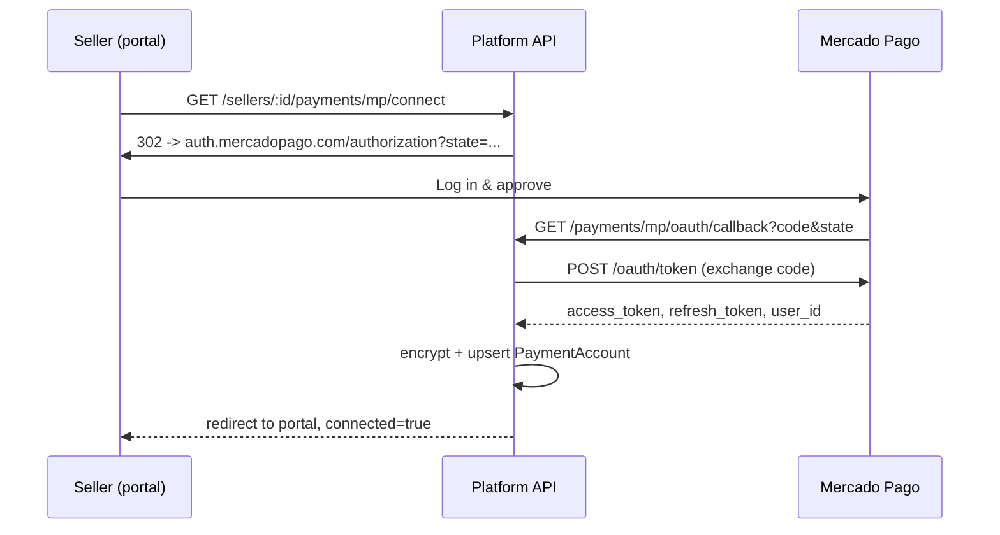
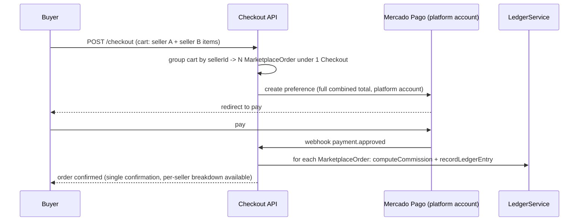
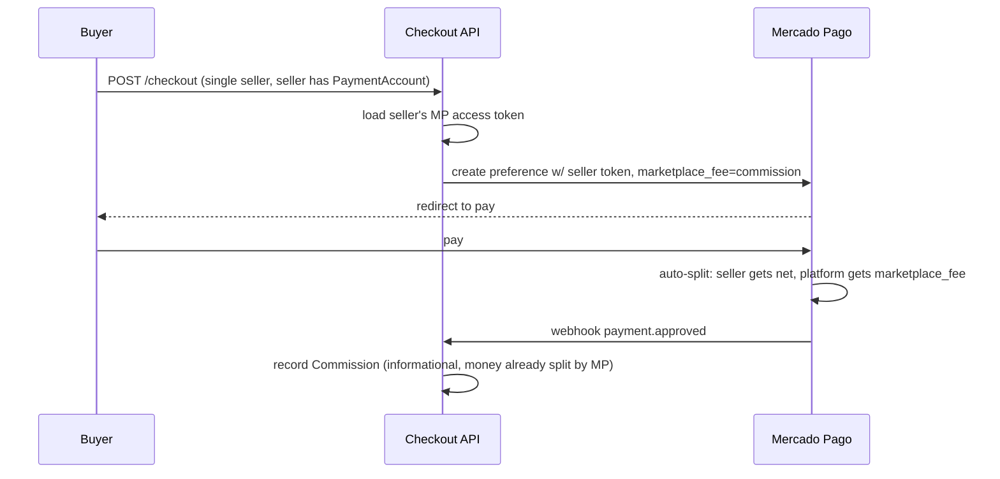
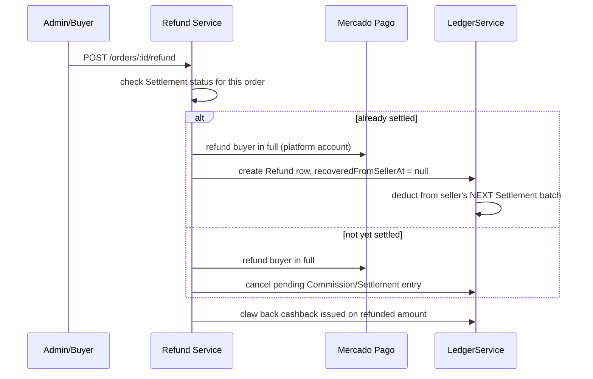
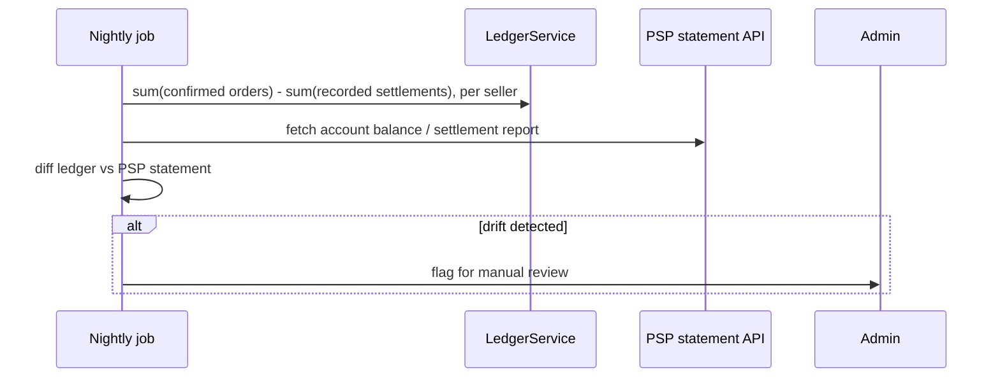

# Marketplace Payment Splitting — Solution Architecture

Status: proposal. Grounded against the current codebase (`apps/api`, `libs/data/db-postgres`) as of 2026-06-18, not a greenfield design — see "Reality check" callouts throughout.

## 0. Reality check against the current repo

Before redesigning, here's what's actually true today, since several premises in the brief don't match this codebase yet:

- **Frontends are React + Vite** (`apps/marketplace`, `apps/seller-portal`, `apps/admin-console`), not Angular. The package structure below assumes React; swap if Angular is a hard requirement.
- **Only one connector is implemented**: `tiendanube` (`connector-registry.service.ts:30`). `connectorType` on `Seller` is a free-text field with `shopify | mercadolibre | woocommerce | odoo | csv | manual | platform` listed as *future* values in a comment — none are wired up. Odoo, Shopify, Mercado Libre connectors don't exist yet.
- **Mercado Pago split is already partially built**: `Seller.mpConnection` (OAuth tokens), `MpSellerOAuthService` (token lifecycle + refresh), and `checkout.service.ts` already sends `marketplace`/`marketplace_fee` to MP's Checkout Pro preference API when a seller has connected. When a seller *hasn't* connected, the platform's own MP account collects 100% and an admin manually marks `MarketplaceOrder.paidOutAt` — this is today's Merchant-of-Record fallback, already in production code, not hypothetical.
- **Multi-seller carts are explicitly rejected today**: `checkout.service.ts:85-91` throws if a cart contains listings from more than one seller. This is the single biggest gap relative to the brief's "multi-vendor cart in one checkout" requirement, and it exists *because* of how MP split payments work (see §2).
- **Commission is computed in-app**, not derived from what MP actually settles (`loyalty.service.ts: computeOrderFees`) — gross drives commission/payout, net-of-credits drives cashback (fixed this session).

Everything below builds on this baseline rather than replacing it.

## 1. Mercado Pago capability audit

| Capability | MP support | Notes |
|---|---|---|
| Seller OAuth onboarding | ✅ Yes | `auth.mercadopago.com/authorization` → `oauth/token`. Already implemented (`mp-seller-oauth.service.ts`). Requires the **platform's own application** to have "MP Connect / Marketplace mode" explicitly activated in the MP developer dashboard — this is an account-level toggle, not a code path, and is the root cause of the "La aplicación no está preparada" error hit this session. |
| Split payment (single seller) | ✅ Yes — **"Split Payments 1:1"** | One payment, one buyer, one seller-collector, one marketplace fee. The payment is created using the **seller's** OAuth access token; `marketplace` (platform's client_id) + `marketplace_fee` (commission, in the order's currency, *not* a percentage) are passed on the preference/payment. |
| Split payment across N sellers in one payment | ⚠️ **Not natively supported** | There is no MP product called "1:N" in their docs — that term doesn't map to anything real on their side. A single MP payment has exactly one collector. Multi-vendor carts must either (a) become N separate payments (one per seller, N redirects or N preferences in sequence), or (b) be collected 100% by the platform (Merchant of Record) and settled to sellers out-of-band. This is *why* `checkout.service.ts` currently rejects multi-seller carts — it was built against MP's real constraint, correctly. |
| Multi-vendor single checkout UX | ❌ Not via MP split | Achievable only with MoR (the buyer never knows N settlements happen behind one payment) or with a "cart splitting" UX (buyer explicitly checks out N sub-orders, possibly N redirects under Checkout Pro, or N silent Checkout API calls if you hold seller tokens server-side). |
| Automatic commission retention | ✅ Yes, for connected sellers (1:1 split) | `marketplace_fee` is retained automatically by MP at settlement time. For unconnected sellers, retention is manual today (admin-tracked ledger, no real bank movement automated). |
| Delayed settlement | ⚠️ Partial | MP doesn't offer an escrow-style "hold funds N days then release" primitive for marketplace splits the way Stripe Connect's manual payouts do. The closest lever is `money_release_days` (merchant-level, not per-split) and refund windows. Effectively: settlement timing is whatever MP's own release schedule for the seller's account is — not controllable from the marketplace side. |
| Refund distribution | ⚠️ Partial / Manual-leaning | On a 1:1 split refund, the refunded amount is taken proportionally from both seller and marketplace balances. If the seller's balance can't cover their share, MP does **not** auto-recover it — the marketplace absorbs or chases the seller manually. There is no built-in dispute/recovery workflow. |
| Chargeback handling | ❌ No marketplace-aware primitive | Chargebacks land on whichever account ultimately collected the card payment (the platform's account under MoR, or split between collector/marketplace under 1:1 — same fund-availability problem as refunds, worse, since it's MP-Visa/Mastercard-driven and outside marketplace control). Must be handled at the application layer with a reserve/risk policy, not a documented MP feature. |
| Prerequisites / approval | Account must be **activated for "Marketplace mode"** in the MP developer dashboard (a one-time toggle, not automatic on app creation) | Plus standard production-credential KYC ("Activar credenciales de producción" + business info). No additional certification process beyond that for `read`/`write`/`offline_access` OAuth scopes. |

**Sources**: MP developer docs (`mercadopago.com.mx/developers/.../split-payments/landing`, `.../split-1-1/integration-configuration/integrate-marketplace`), and this session's live debugging against app `6846892604370730`.

## 2. Model comparison

| Model | Multi-seller cart in 1 buyer payment | Settlement timing | Commission certainty | Refund/chargeback complexity | Compliance burden on platform | Fits MP today? |
|---|---|---|---|---|---|---|
| **MP Split 1:1** | No — 1 seller per payment | MP's own release schedule per seller | High (deducted at settlement) | Medium — proportional split, no auto-recovery if seller balance short | Low (MP is MoR for funds-handling/PCI) | Yes, already half-built |
| **"1:N" split** | N/A — not a real MP product | — | — | — | — | Doesn't exist; would require N×(1:1) under the hood |
| **Merchant of Record (MoR)** | **Yes** — platform collects 100%, settles sellers separately | Fully platform-controlled (e.g. weekly payout batch) | Highest — platform computes and owns the ledger | Lowest application complexity — platform eats/manages disputes centrally, then nets against seller payouts | **Higher** — platform is the legal merchant of record for tax/AML/PCI in most readings, may need money-transmitter consideration depending on jurisdiction | Yes — this is what unconnected sellers already do |
| **Manual settlement** (today's fallback) | Yes (incidentally, since no real split happens) | Whenever an admin acts | Tracked, but payout is a human action outside the platform | Same as MoR but with zero automation | Same as MoR, minus the operational tooling | Yes — already in prod (`paidOutAt`) |

## 3. Recommendation

**Default to Merchant of Record with an internal ledger, and treat MP's native 1:1 split as an optional "fast settlement" mode per seller — not the backbone.**

Why, specifically for this platform:
1. The brief's hard requirement — multi-vendor carts in a single buyer checkout — is **incompatible with MP's actual 1:1-only split model**. MoR is the only model that satisfies it without forcing N redirects on the buyer.
2. The brief also asks for provider-agnosticism (future Stripe Connect / Adyen MarketPay / PayPal Marketplace). Stripe Connect and Adyen MarketPay *do* support true multi-party splits per payment — but building the domain model around MoR-with-a-ledger means the same domain model (Order → Commission → Payout) works whether the underlying rail does real splitting (Stripe) or not (MP). If the domain model were built around MP's 1:1 split semantics instead, porting to Stripe Connect later would require a rewrite, not an adapter swap.
3. It matches what's already shipped: unconnected-seller MoR + manual payout already exists; this proposal is "automate the payout half of what already works," not "introduce a new model."
4. Keep MP 1:1 split as an **opt-in fast path** for single-seller carts where the seller has completed OAuth — it reduces platform settlement float and risk for that subset of orders, at no domain-model cost since it's just a different `SettlementProvider` strategy for those orders.

## 4. Business architecture

### Seller onboarding flow
1. Seller registers on seller-portal → `Seller` row created, `status: pending`.
2. Seller connects store connector (Tiendanube today) → catalog sync begins (existing `SellerProductMapping` matching pipeline).
3. Seller optionally connects MercadoPago via OAuth (`GET /sellers/:id/payments/mp/connect`) — **optional**, not gating; sellers who skip this stay on MoR + scheduled payout.
4. Platform admin reviews/approves → `status: active`, listings can be published.

### Buyer checkout flow (target state, multi-seller)
1. Cart may contain listings from N sellers.
2. Checkout creates **one `Checkout` aggregate** with **N `MarketplaceOrder` children**, one per seller — buyer sees one combined total, one payment screen.
3. Single payment is created **against the platform's own MP account** (MoR) for the full combined total.
4. On payment confirmation, the platform fans out: each `MarketplaceOrder` gets its own commission computed (`loyalty.service.ts`-style, per seller's `commissionRate`), and a `Commission`/ledger entry is booked — no money moves to sellers yet, that's the settlement flow's job.
5. Buyer never sees per-seller commission math — confirmed by design, matches existing `loyalty.service.ts` doc comment.

### Settlement flow
1. Scheduled job (e.g. weekly) aggregates each seller's confirmed, non-disputed `MarketplaceOrderLine`s since last settlement into a `Settlement` batch.
2. `Settlement.netAmount = sum(lineTotal) - sum(commission) - reserveHeld`.
3. `SettlementProvider` abstraction executes the actual transfer:
   - MP path: `POST /v1/account/money_transfers` style transfer or manual bank transfer reference, OR — for OAuth-connected sellers on the fast path — settlement already happened automatically at payment time via `marketplace_fee`, so this batch just reconciles/confirms it happened rather than initiating a transfer.
   - Future Stripe path: `stripe.transfers.create` to the seller's connected account.
4. `Payout` row recorded, linked to the `Settlement` and underlying orders, replacing today's manual `paidOutAt` boolean with a real ledger entry.

### Refund flow
1. Refund requested (buyer, seller, or admin) against a `MarketplaceOrder`.
2. Platform checks `Settlement` status for that order's commission/payout:
   - Not yet settled → refund cancels the pending commission/payout entries cleanly (no money moved yet, this is the easy case).
   - Already settled → platform refunds buyer in full from its own collected funds, then **deducts the seller's share from their next `Settlement` batch** (a `Refund` row with `recoveredFromSellerId` + `recoveredAt`, nullable until actually netted out). This sidesteps MP's "no auto-recovery" gap by owning recovery as a ledger operation instead of relying on the PSP.
3. Cashback already awarded on the refunded amount is clawed back from the buyer's wallet (extends existing `awardCashback`/wallet transaction pattern).

### Chargeback flow
1. Chargeback webhook/notification arrives at the platform's MP account (since platform is MoR collector).
2. Treated as a forced refund (same flow as above) plus a `disputeStatus` flag and a reserve hold against that seller's *future* settlements (e.g. hold 1.5× the disputed amount for 30 days) to cover the case the chargeback is lost.
3. No MP-side automation exists for this — it's entirely an application-layer risk policy, matching the capability audit's finding of zero marketplace-aware chargeback primitives.

## 5. Technical architecture

### Domain model (entities, see §6 for schema)
`Seller → PaymentAccount (provider-specific OAuth/credentials) → MarketplaceOrder → MarketplaceOrderLine → Commission → Settlement → Payout → Refund`, with `Checkout` as the buyer-facing aggregate root spanning N `MarketplaceOrder`s.

### Services (NestJS modules)
- `CheckoutService` (exists) — extended to fan out a multi-seller cart into N `MarketplaceOrder`s under one `Checkout`.
- `PaymentProviderModule` — new abstraction (see §7): `PaymentProvider` interface, `MercadoPagoProvider` implementation wrapping today's `MpSellerOAuthService` + preference logic.
- `SettlementService` — new; owns the settlement batch job, `SettlementProvider` strategy selection (MoR-batch vs. PSP-native-split-already-happened).
- `LedgerService` — new; single source of truth for commission/cashback/refund/payout money movements, replacing ad-hoc fields scattered on `MarketplaceOrder` today.
- `LoyaltyService` (exists) — unchanged role, feeds `LedgerService`.
- `RefundService` / `DisputeService` — new; implements the recovery-from-next-settlement logic.

### OAuth token lifecycle
Already correctly implemented in `MpSellerOAuthService`: encrypted-at-rest (`credential-crypto.ts`, AES-256-GCM) `accessToken`/`refreshToken`, auto-refresh when <5 min from expiry (`getSellerAccessToken`). Generalize this into a `PaymentAccount` table so the same lifecycle pattern (encrypt, refresh-on-read, scope tracking) applies to Stripe Connect/Adyen tokens later without a new code path.

### Event-driven architecture
Introduce a `payment.confirmed` / `order.refunded` / `settlement.completed` / `chargeback.received` event bus (in-process event emitter is enough at current scale; BullMQ — already in the stack for sync jobs — for anything that must survive a process restart, e.g. settlement batches). `LedgerService` and `LoyaltyService` become event consumers instead of being called inline from `CheckoutService`, decoupling "did the payment succeed" from "what does that mean for commission/cashback/settlement."

### Idempotency strategy
- Webhook handlers (`checkout.webhooks.mercadopago`) already need this — every external-side-effect (MP webhook, reconcile poll) must key off `(paymentId, eventType)` and be a no-op on replay. Use a `ProcessedWebhookEvent` table (`@@unique([provider, externalEventId])`) rather than relying on in-memory dedup.
- Settlement batches: idempotency key = `(sellerId, periodStart, periodEnd)` — re-running a batch job must never double-pay.
- Refund recovery against next settlement: idempotency key = `refundId`, since a refund must be recovered exactly once.

### Reconciliation strategy
- Nightly job compares platform ledger (`sum of confirmed orders - sum of recorded settlements`) against the PSP's actual account balance/statement API, flags drift for admin review — this generalizes the existing `checkout/orders/:id/reconcile` single-order endpoint into a batch-level check.

## 6. Database design (additive to current schema)

Entities already in `schema.prisma`: `Seller`, `SellerMpConnection`, `MarketplaceOrder`, `MarketplaceOrderLine`, `CustomerWallet`, `StoreCredit`, `WalletTransaction`.

New/changed entities:

```prisma
model Checkout {
  id             String   @id @default(cuid())
  customerId     String?
  totalMinorUnits Int
  currency       String
  status         String   // pending | paid | failed | refunded
  paymentId      String?  // PSP-side payment/charge id
  provider       String   // 'mercadopago' | 'stripe' | 'adyen' | 'paypal'
  orders         MarketplaceOrder[]
  createdAt      DateTime @default(now())
}

// MarketplaceOrder gains:
//   checkoutId String?  (nullable for backcompat with pre-multi-seller orders)
//   checkout   Checkout? @relation(fields: [checkoutId], references: [id])

model PaymentAccount {
  id             String   @id @default(cuid())
  sellerId       String   @unique
  provider       String   // 'mercadopago' | 'stripe' | 'adyen' | 'paypal'
  externalId     String   // MP merchantId / Stripe connected account id / etc.
  scope          String?
  encryptedCreds Json
  status         String   @default("connected") // connected | expired | revoked
  connectedAt    DateTime @default(now())
  updatedAt      DateTime @updatedAt
  seller         Seller   @relation(fields: [sellerId], references: [id])
}
// SellerMpConnection becomes a thin legacy view / is migrated into PaymentAccount(provider='mercadopago')

model Commission {
  id              String   @id @default(cuid())
  orderId         String   @unique
  grossMinor      Int
  commissionMinor Int
  netPayoutMinor  Int
  computedAt      DateTime @default(now())
  order           MarketplaceOrder @relation(fields: [orderId], references: [id])
}

model Settlement {
  id            String   @id @default(cuid())
  sellerId      String
  periodStart   DateTime
  periodEnd     DateTime
  grossMinor    Int
  commissionMinor Int
  netMinor      Int
  status        String   @default("pending") // pending | executing | completed | failed
  provider      String
  externalRef   String?  // PSP transfer id, or bank reference for manual
  seller        Seller   @relation(fields: [sellerId], references: [id])
  payouts       Payout[]
  createdAt     DateTime @default(now())
  @@unique([sellerId, periodStart, periodEnd])
}

model Payout {
  id           String   @id @default(cuid())
  settlementId String
  amountMinor  Int
  status       String   @default("pending") // pending | sent | failed
  executedAt   DateTime?
  settlement   Settlement @relation(fields: [settlementId], references: [id])
}

model Refund {
  id                 String   @id @default(cuid())
  orderId            String
  amountMinor        Int
  reason             String?
  isChargeback       Boolean  @default(false)
  recoveredFromSellerAt DateTime?
  recoverySettlementId  String?
  order              MarketplaceOrder @relation(fields: [orderId], references: [id])
  createdAt          DateTime @default(now())
}

model ProcessedWebhookEvent {
  id              String   @id @default(cuid())
  provider        String
  externalEventId String
  processedAt     DateTime @default(now())
  @@unique([provider, externalEventId])
}
```

## 7. Sequence diagrams

### 7.1 Seller onboarding (MP connect)


### 7.2 Multi-seller checkout (target state, MoR)


### 7.3 Split payment (single-seller, OAuth fast path)


### 7.4 Refund (post-settlement case)


### 7.5 Reconciliation


## 8. Monorepo structure (Nx, current React stack — substitute Angular paths if required)

```
apps/
  api/                      # NestJS — unchanged location
    src/
      payments/              # NEW: provider-agnostic PaymentProvider abstraction
        provider.interface.ts
        mercadopago.provider.ts
        stripe.provider.ts          (future)
        adyen.provider.ts           (future)
      settlement/             # NEW: SettlementService, batch job, SettlementProvider
      ledger/                 # NEW: LedgerService, Commission/Refund/Payout writes
      checkout/                # existing — extended for multi-seller fan-out
      connectors/              # existing — tiendanube today; odoo/shopify/mercadolibre future
  marketplace/ | seller-portal/ | admin-console/   # existing React apps
libs/
  data/db-postgres/           # existing Prisma schema + migrations
  payments/
    provider-mercadopago/     # existing POS-terminal adapter — keep separate from marketplace payments/ module above; different MP product (Point) vs marketplace split
  domain/
    shared-kernel/            # existing Money value object — reuse for Commission/Settlement math
docs/
  architecture/               # this document
```

## 9. Risk analysis

| Risk | Impact | Mitigation |
|---|---|---|
| Multi-seller cart can't use native PSP split | Forces MoR, increases platform's settlement/compliance surface | Accepted tradeoff per §3 recommendation; mitigated by ledger-based settlement, not avoided |
| Settlement batch failure (partial transfer) | Sellers underpaid/overpaid, trust damage | Idempotent `(sellerId, period)` batches; `Payout.status` state machine; alerting on `failed` |
| OAuth token expiration/revocation mid-checkout | Seller's fast-path payment fails at the worst time (buyer mid-checkout) | Already mitigated for expiry (auto-refresh in `getSellerAccessToken`); revocation needs a webhook listener + fallback to MoR for that seller's orders rather than hard-failing checkout |
| Refund when seller balance can't cover their share | Platform eats the loss or chases seller | §4 refund flow recovers from *next* settlement instead of relying on MP's (nonexistent) auto-recovery |
| Chargebacks | Same as refunds, plus card-network timelines or platform reputation risk | Reserve-hold policy on disputed sellers; track `disputeStatus` distinct from plain refunds |
| Double payment (webhook replay / buyer double-click) | Buyer charged twice, or order double-confirmed | `ProcessedWebhookEvent` idempotency table; existing reconcile endpoint pattern generalized |
| Distributed transaction across Checkout → N Orders → N Commissions | Partial failure leaves inconsistent state (e.g. payment confirmed but commission never booked) | Event-driven with at-least-once delivery + idempotent consumers, not a DB-level distributed transaction; `Checkout.status` only flips to `paid` after all N order fan-outs succeed, retried via the event bus on partial failure |
| MP "Marketplace mode" not enabled at the account level | Entire OAuth connect flow fails in production with an opaque error (hit this session) | One-time dashboard checklist item before any seller can be onboarded to the fast path; document in runbook |

## 10. Provider abstraction (future expansion)

```ts
// apps/api/src/payments/provider.interface.ts
interface PaymentProvider {
  getAuthUrl(sellerId: string): string;
  exchangeCode(code: string, state: string): Promise<PaymentAccountCreds>;
  createCheckout(opts: CreateCheckoutOpts): Promise<{ redirectUrl: string; externalRef: string }>;
  supportsNativeSplit(): boolean; // MP: true for single-seller 1:1; Stripe Connect/Adyen MarketPay: true for true N-way
}

interface SettlementProvider {
  settle(batch: SettlementBatch): Promise<{ externalRef: string; status: 'completed' | 'pending' | 'failed' }>;
}
```

`MercadoPagoProvider` implements both: `supportsNativeSplit()` returns true only for single-seller carts where the seller has a connected `PaymentAccount` — `CheckoutService` checks this per-cart to pick the 1:1 fast path vs. the MoR fallback. Adding `StripeConnectProvider` later means: implement the same interface (Stripe Connect *does* support genuine multi-party splits per charge, so its `supportsNativeSplit()` could return true even for multi-seller carts) — no change to `CheckoutService`'s orchestration logic, only to which provider is selected and what `supportsNativeSplit()` reports.

## 11. Implementation roadmap

1. **Ledger foundation** — add `Commission`, `Settlement`, `Payout`, `Refund`, `ProcessedWebhookEvent` tables; backfill `Commission` rows from existing `MarketplaceOrder.commissionMinorUnits`. No behavior change yet.
2. **Settlement automation** — `SettlementService` batch job replacing manual `paidOutAt` toggle; ship behind a flag, run in parallel with manual process until trusted.
3. **Multi-seller checkout** — introduce `Checkout` aggregate, relax the `sellerIds.length > 1` guard in `checkout.service.ts`, fan out to N `MarketplaceOrder`s, single combined MP preference under MoR.
4. **Refund recovery flow** — `RefundService` with next-settlement deduction; close the "MP doesn't auto-recover" gap.
5. **Provider abstraction** — extract `PaymentProvider`/`SettlementProvider` interfaces; refactor `MpSellerOAuthService` + preference logic behind `MercadoPagoProvider` with no behavior change (pure refactor, validated by existing tests).
6. **Second provider** (Stripe Connect recommended first — most mature multi-party split support) — implement against the same interfaces as a forcing function that the abstraction actually holds.
