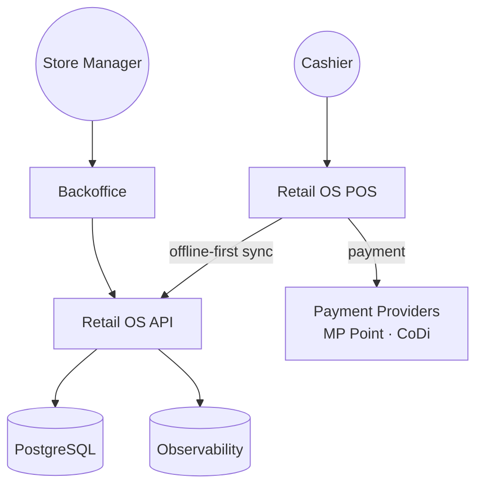
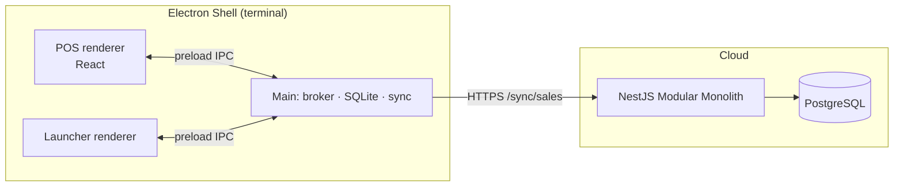
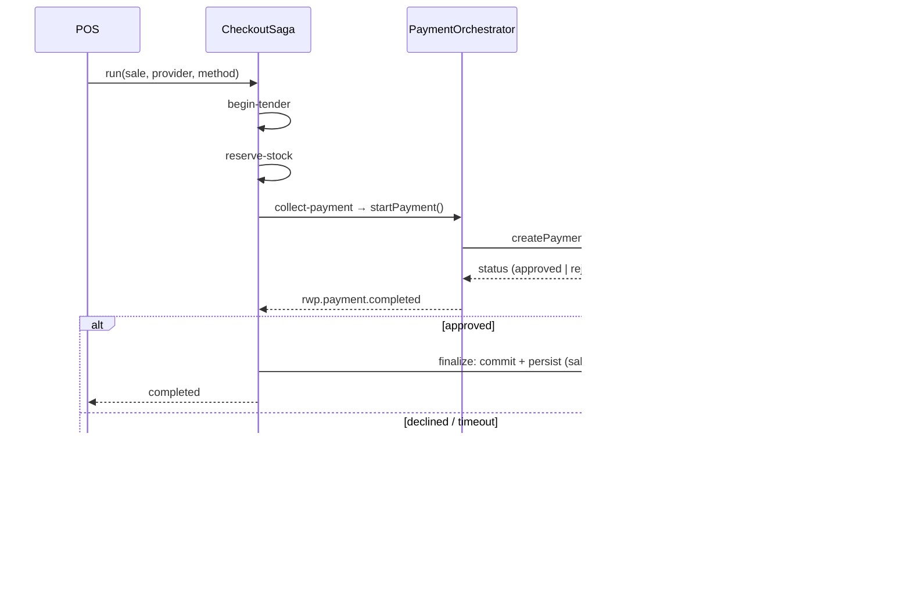
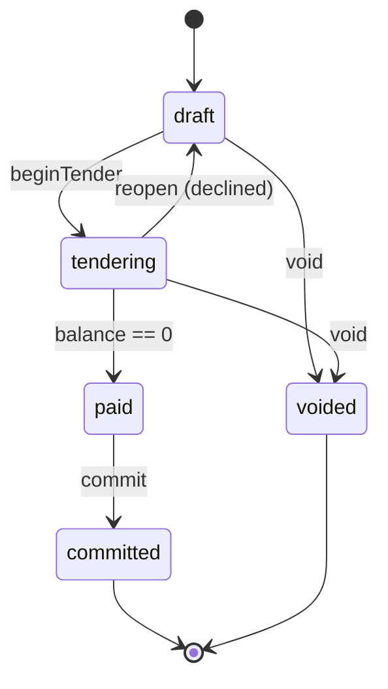

# Diagrams

## C4 — Context

```mermaid
flowchart TB
  Cashier((Cashier)) --> POS[Retail OS POS]
  Manager((Store Manager)) --> BO[Backoffice]
  POS -->|"offline-first sync"| API[Retail OS API]
  BO --> API
  API --> PG[(PostgreSQL)]
  POS -->|payment| PAY[Payment Providers\nMP Point · CoDi]
  API --> OTEL[(Observability)]
```

## C4 — Containers

```mermaid
flowchart LR
  subgraph Desktop["Electron Shell (terminal)"]
    SHELL[Main: broker · SQLite · sync] 
    LAUNCH[Launcher renderer]
    POSAPP[POS renderer\nReact]
  end
  subgraph Cloud
    API[NestJS Modular Monolith]
    PG[(PostgreSQL)]
  end
  POSAPP <-->|preload IPC| SHELL
  LAUNCH <-->|preload IPC| SHELL
  SHELL -->|HTTPS /sync/sales| API --> PG
```

## Checkout Saga — sequence

```mermaid
sequenceDiagram
  participant POS
  participant Saga as CheckoutSaga
  participant Orch as PaymentOrchestrator
  participant Prov as Provider Simulator
  participant DB as SQLite
  POS->>Saga: run(sale, provider, method)
  Saga->>Saga: begin-tender
  Saga->>Saga: reserve-stock
  Saga->>Orch: collect-payment → startPayment()
  Orch->>Prov: createPaymentIntent()
  Prov-->>Orch: status (approved | rejected | timeout)
  Orch-->>Saga: rwp.payment.completed
  alt approved
    Saga->>DB: finalize: commit + persist (sale+outbox)
    Saga-->>POS: completed
  else declined / timeout
    Saga->>Saga: compensate (release stock, reopen cart)
    Saga-->>POS: failed (cart preserved)
  end
```

## State — Sale lifecycle

```mermaid
stateDiagram-v2
  [*] --> draft
  draft --> tendering: beginTender
  tendering --> draft: reopen (declined)
  tendering --> paid: balance == 0
  paid --> committed: commit
  draft --> voided: void
  tendering --> voided: void
  committed --> [*]
  voided --> [*]
```
