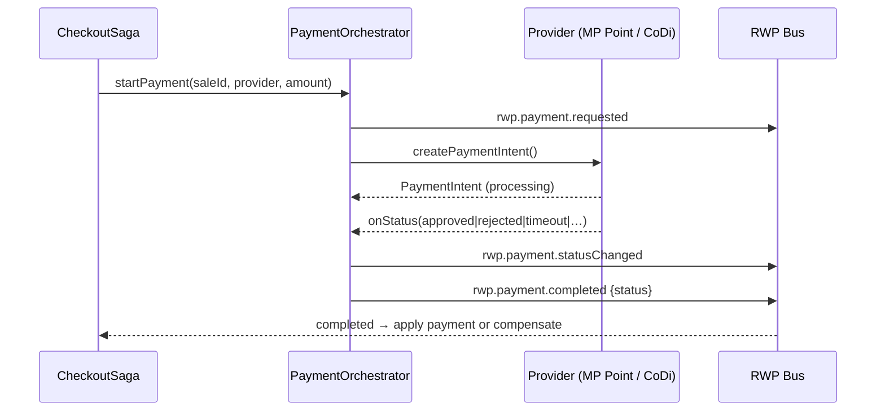

# Payments

## Orchestrator + ports
The POS calls **one** entry point — the `PaymentOrchestrator` — never a provider. Providers
implement the `IPaymentProvider` port:

```ts
interface IPaymentProvider {
  readonly id: string;
  readonly supportedMethods: PaymentMethod[];
  createPaymentIntent(req): Promise<PaymentIntent>;
  cancelPayment(paymentId): Promise<void>;
  refundPayment(paymentId, amount?): Promise<Refund>;
  getPaymentStatus(paymentId): Promise<PaymentStatus>;
  onStatus(paymentId, handler): () => void;   // webhook/poll abstraction
}
```

The orchestrator creates the intent and republishes provider transitions as the unified RWP
events `rwp.payment.requested` → `statusChanged` → `completed`. See [ADR-0005](adr/0005-payment-orchestrator-ports.md).



## Providers

### Mercado Pago Point (`@retail-os/provider-mercadopago`)
- **`MercadoPagoPointAdapter`** — production adapter over the official **Orders API**
  (`POST /v1/orders` type `point`, terminal id, webhook status, `/cancel`, `/refund`).
  Requires credentials + a public webhook; throws a clear error until configured.
- **`MercadoPagoPointSimulator`** — offline terminal stand-in: Approved / Rejected /
  Timeout / Cancelled, forced via `metadata.simulate`.

### CoDi (`@retail-os/provider-codi`)
- **`CoDiProvider`** — production adapter for Banxico CoDi dynamic-QR collections via a
  participating bank's gateway (collection message → QR + expiry, webhook status, SPEI
  returns for refunds).
- **`CoDiSimulator`** — offline dynamic-QR stand-in: Approved / Rejected / Timeout /
  Expired, with a realistic QR payload and expiry.

## Rollout phases
1. **Phase 1:** Mercado Pago Point, CoDi, SPEI.
2. **Phase 2:** Clip, OpenPay, Stripe Terminal.
3. **Phase 3:** Adyen, direct bank integrations.

Each phase is additive — new providers register with the orchestrator; the POS and
CheckoutSaga are untouched.
