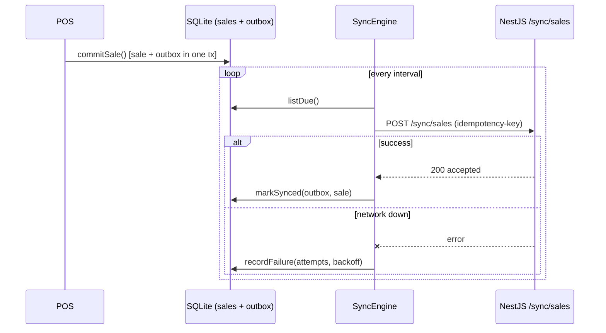

# Synchronization Engine

## Goal
Ship every committed sale from the terminal's SQLite to the central API with **at-least-once
delivery** and **eventual consistency** — never blocking the cashier, never losing a sale,
never requiring a distributed transaction.

## Mechanism
1. **Transactional outbox.** Committing a sale writes the `sales` row **and** an `outbox`
   row in one SQLite transaction. Durability is guaranteed before any network call.
2. **Drain loop.** `SyncEngine` polls due outbox messages and pushes each through the
   `SyncTarget` port (`HttpSyncTarget` in production, `InMemorySyncTarget` offline/tests).
3. **Backoff.** A failed push reschedules the message with exponential backoff
   (`baseBackoffMs · 2^attempts`, capped); the cashier keeps selling, the queue grows.
4. **Idempotency.** Each message carries an idempotency key (the outbox id). The server
   records keys in `IngestionKey`, so re-delivery after a flaky network is a no-op —
   **exactly-once effect** on top of at-least-once delivery.
5. **Status.** The engine emits `{ online, pending, lastSyncedAt }` for the POS status bar.

## Conflict resolution & roadmap
- Sales are **immutable facts** once committed, so upload conflicts don't arise; the server
  dedupes by idempotency key.
- **Downlink** (master data: products, prices, promotions) uses last-writer-wins by
  `updatedAt` per tenant, pulled on an interval — implemented on the roadmap.
- Dead-letter visibility for messages exceeding `maxAttempts` surfaces in the backoffice.
- No two-phase commit, ever.
